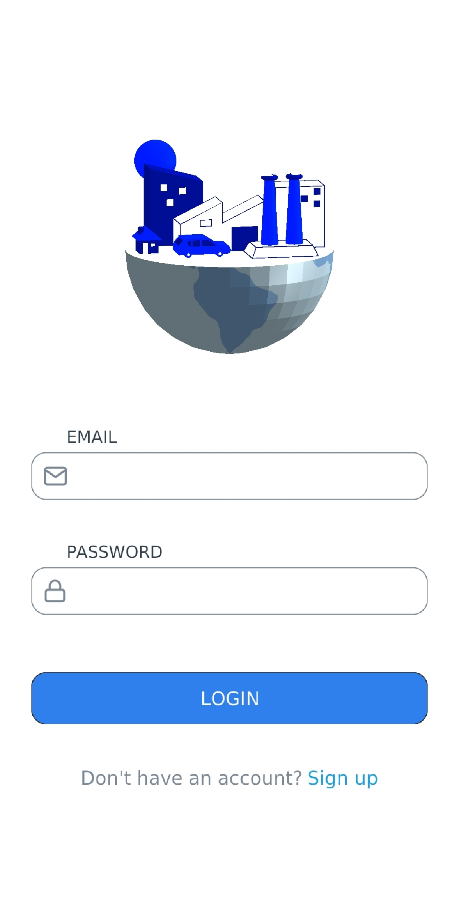
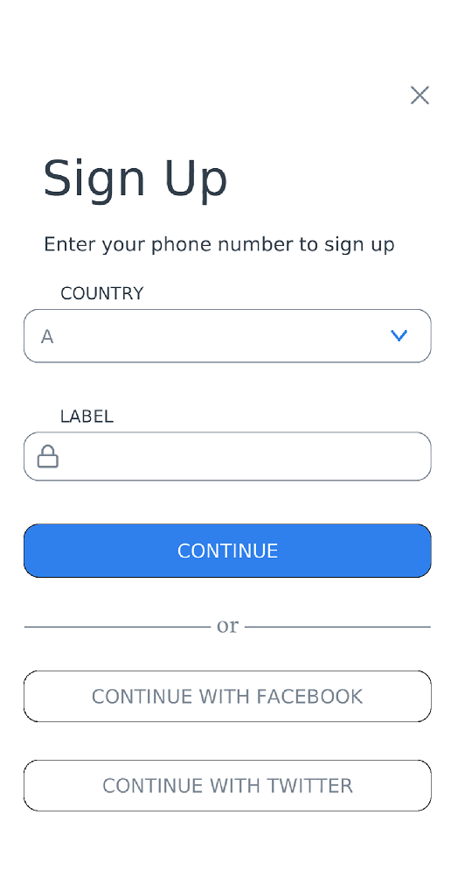
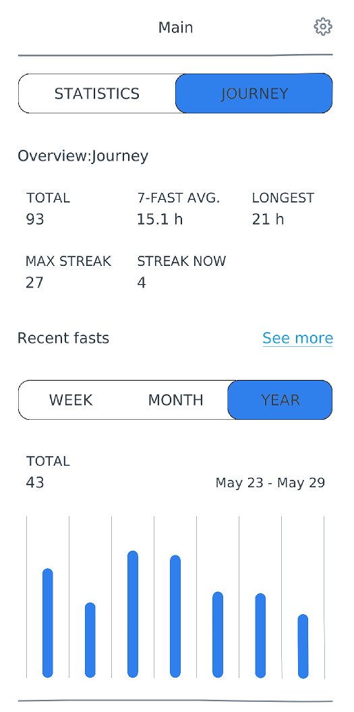
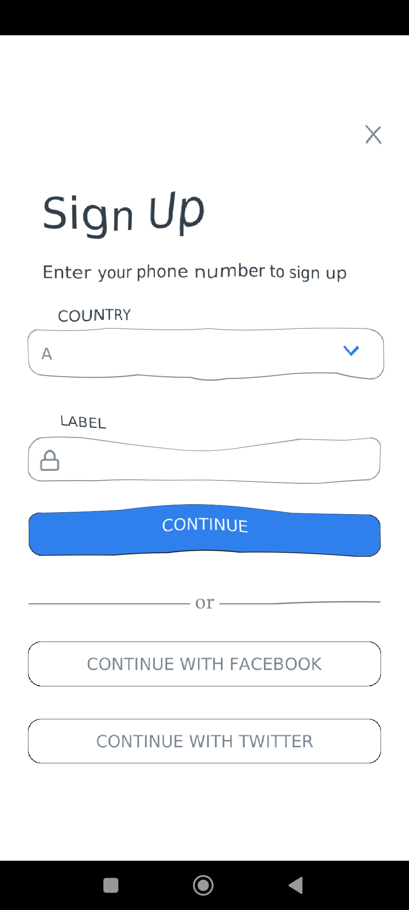

# A Simple App Made In LibGDX

Hello everyone!!! This is a [libGDX](https://libgdx.com/) made using a variety of tools. I hope that this readme will be
able to cover up most of the tech/tools I have used throughout the project.

- The project architecture was generated using [gdx-liftoff](https://github.com/tommyettinger/gdx-liftoff) which provided
a simple setup for lwjgl (desktop) and android builds via gradle. 
- Further, I used [Vis-UI](https://github.com/kotcrab/vis-ui) to design the skeleton for the GUI.
- To design the user interface, I created most of the images using [Pixelitor](https://github.com/lbalazscs/Pixelitor).
- This project has a lot of Nine Patches around the UI and even uses a few [Ten Patch](https://github.com/raeleus/TenPatch) elements too. 
- Finally, to draw a custom widget to show the plots, I used the [Shape Drawer](https://github.com/earlygrey/shapedrawer.

### A glimpse on the finished UI

I also used a bit of Shaders to give me a shock wave effect whenever a person clicks away form buttons.

And the whole screen-to-screen transition is animated! Please view this screen record:

To run this project on desktop:
- `lwjgl3:run`: starts the application.
- `lwjgl3:dist`: creates a distributable.

To run this project on android:
- `android:run`: starts the application.
- `android:dist`: creates a distributable.